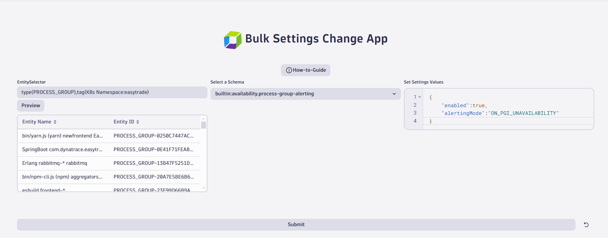
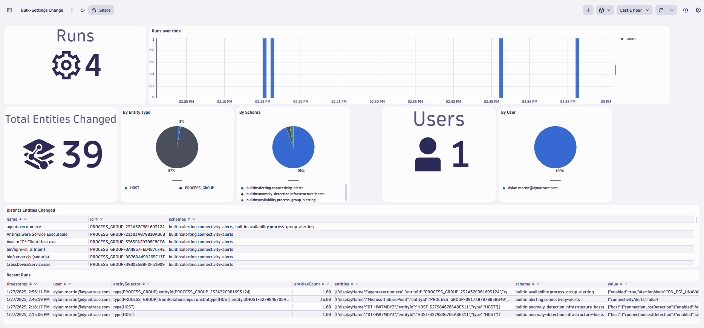

# Dynatrace Bulk Settings Change App

This application was developed using Dynatrace AppEngine. This app is to be used for applying Dynatrace Settings 2.0 configurations across a bulk number of entities at once.

## Deploy in your environment
1. Clone the repo
2. edit **app.config.ts**. 
     - Change the *name, version, and id* fields to your own unique values.
3. In the project directory run `npm run deploy` to deploy it your environment.

## Setup Dashboard
Use this ready-made dashboard to monitor the usage off this custom app in your environment. Find the dashboard here: [dashboard JSON](./dashboard/Bulk-Settings%20Change.json)
